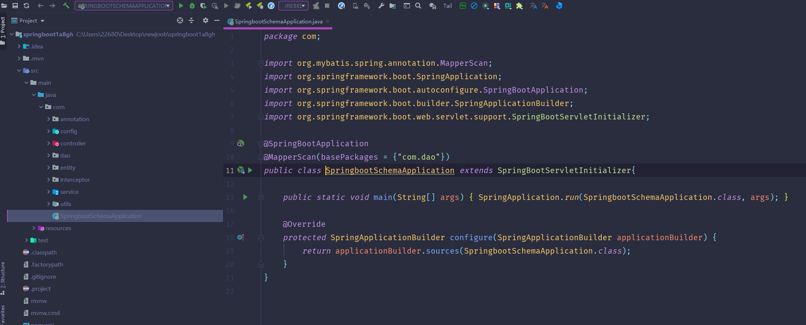
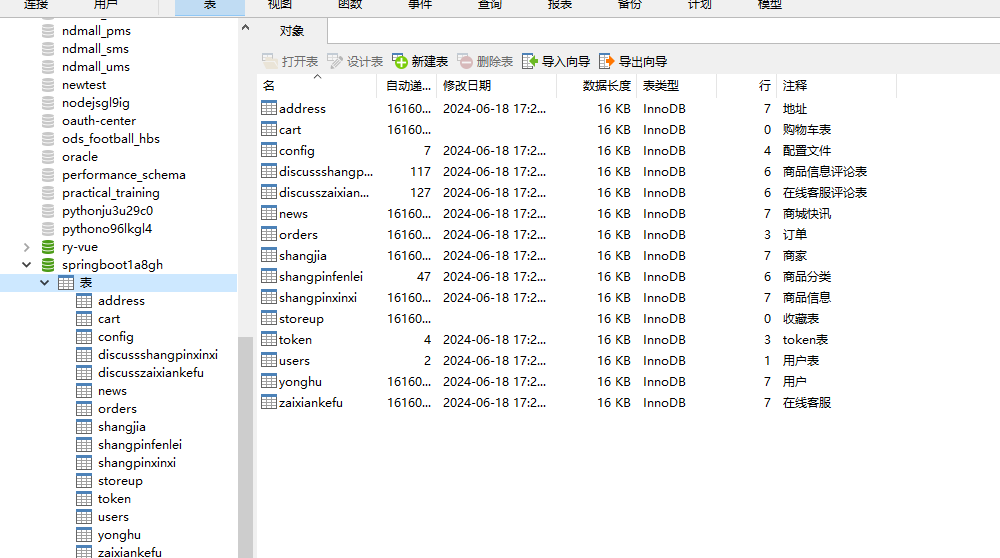
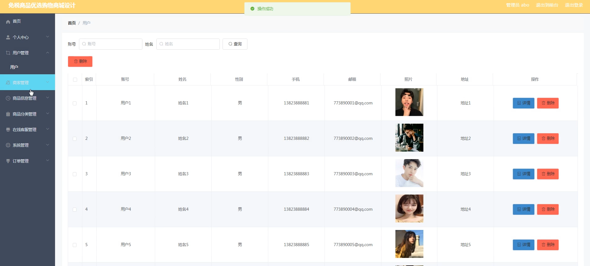
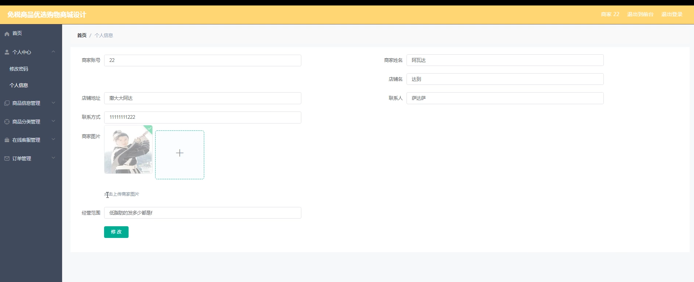
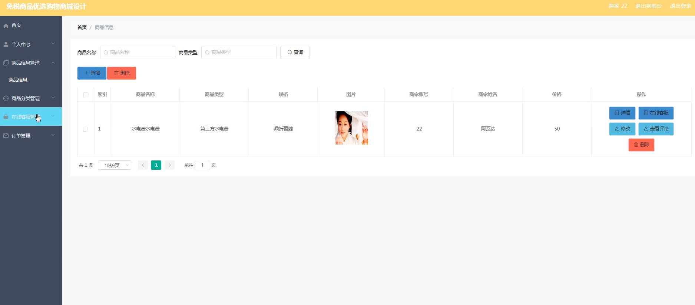
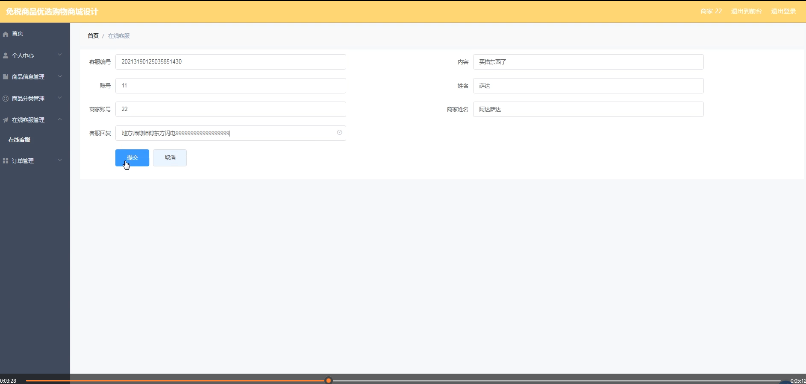
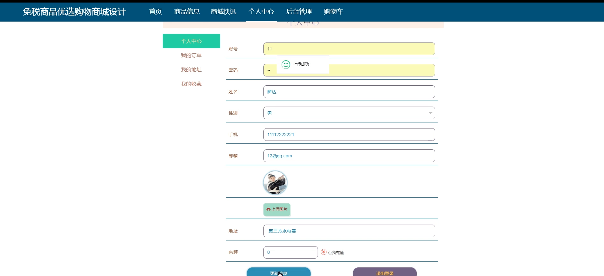
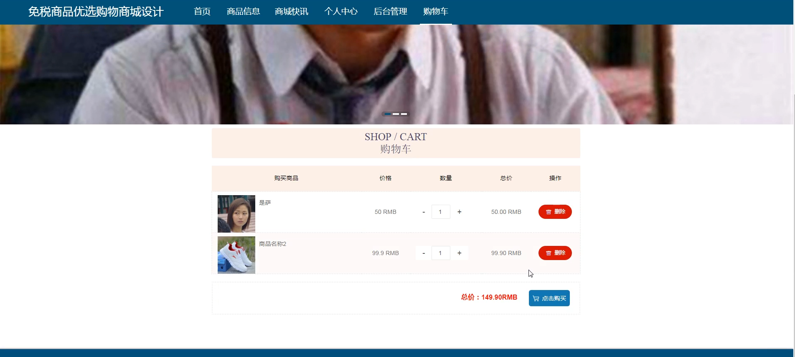
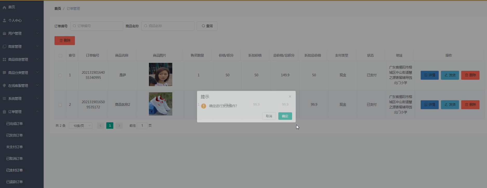

# 基于Java的免税商品优选购物商城

#### 介绍
基于Java开发的免税商品优选购物商城系统是一款专门针对免税商品设计的在线购物平台。该系统旨在为用户提供便捷的购物体验，同时为商家和管理员提供高效的管理工具。系统包含三个主要角色：管理端、商家端和用户端。每个角色拥有特定的功能模块，满足各自的操作需求。

#### 技术栈介绍

后端技术栈：Springboot+Mysql+Maven

前端技术栈：Vue+Html+Css+Javascript+ElementUI

开发工具：Idea+Vscode+Navicate

#### 系统功能介绍

管理端功能模块

个人中心：管理员可以查看和修改个人信息，管理账户安全设置。

用户管理：管理员可以管理平台上的用户信息，包括用户注册、删除和权限设置。

商家管理：管理员可以审核和管理商家的注册信息和权限，确保平台商家的合法性和合规性。

商品信息管理：管理员可以添加、修改和删除商品信息，确保商品信息的准确性和及时更新。

商品分类管理：管理员可以对商品进行分类管理，方便用户查找和浏览。

在线客服管理：管理员可以管理客服信息，确保用户和商家能够及时获得帮助和支持。

系统管理：管理员可以进行系统配置和维护，确保系统的稳定运行。

订单管理：管理员可以查看和管理平台上的所有订单，跟踪订单状态，处理订单问题。

商家端功能模块

个人中心：商家可以查看和修改个人信息，管理账户安全设置。

商品信息管理：商家可以添加、修改和删除自己的商品信息，确保商品信息的准确性和及时更新。

商品分类管理：商家可以对自己的商品进行分类管理，方便用户查找和浏览。

在线客服管理：商家可以提供在线客服服务，与用户进行即时沟通和问题解决。

订单管理：商家可以查看和管理用户的订单，跟踪订单状态，处理订单问题。

用户端功能模块

商品信息：用户可以浏览和搜索商品信息，查看商品详情。

商城快讯：用户可以查看商城的最新公告和促销信息，了解最新动态和优惠活动。

个人中心：用户可以查看和修改个人信息，管理账户安全设置。

后台管理：

商品信息管理：用户可以管理自己的购物记录和收藏商品。

在线客服管理：用户可以联系在线客服，获得购物帮助和问题解答。

我的收藏管理：用户可以管理自己收藏的商品，方便日后购买。

订单管理：用户可以查看和管理自己的订单，跟踪订单状态。

购物车：用户可以将想购买的商品加入购物车，方便集中结算和支付。

#### 系统作用

对管理员的作用

高效的用户和商家管理：管理员可以通过系统高效地管理用户和商家信息，确保平台的规范运营。

精准的商品信息管理：系统提供详细的商品信息管理功能，确保商品信息的准确性和及时性。

及时的订单处理：管理员可以通过系统跟踪和处理订单，确保订单的及时交付和问题解决。

对商家的作用

便捷的商品管理：商家可以通过系统方便地管理自己的商品信息和分类，提高商品展示的效率。

即时的客户服务：商家可以通过在线客服功能与用户即时沟通，解决用户问题，提高客户满意度。

有效的订单跟踪：商家可以通过系统实时跟踪订单状态，及时处理订单问题，确保订单的顺利完成。

对用户的作用

丰富的商品选择：用户可以通过系统浏览和搜索各类免税商品，享受便捷的购物体验。

最新的商城动态：用户可以通过商城快讯功能了解最新的公告和促销信息，把握购物时机。

完善的订单管理：用户可以通过系统查看和管理自己的订单，跟踪订单状态，确保购物无忧。

#### 系统功能截图

代码结构

数据库表

登录

用户管理

商家端

商品信息

用户端首页

在线客户

商城快讯

用户端个人中心

购物车

订单管理

#### 总结

基于Java的免税商品优选购物商城系统通过分角色、分模块的设计，实现了管理员、商家和用户的全面功能覆盖。管理员角色的高效管理和精准的商品信息管理，为平台的规范运营提供了保障；商家角色的便捷商品管理和即时客户服务功能，提升了商家的管理效率和客户满意度；用户角色的丰富商品选择和完善的订单管理功能，满足了用户的多样化需求。系统通过全面的功能设计和友好的用户界面，为免税商品的在线销售提供了高效便捷的解决方案，提升了整体购物体验和平台管理效率。

#### 使用说明

创建数据库，执行数据库脚本 修改jdbc数据库连接参数 下载安装maven依赖jar 启动idea中的springboot项目

后台地址：http://localhost:8080/springboot1a8gh/admin/dist/index.html

管理员  abo 密码 abo

前台地址：http://localhost:8080/springboot1a8gh/front/index.html